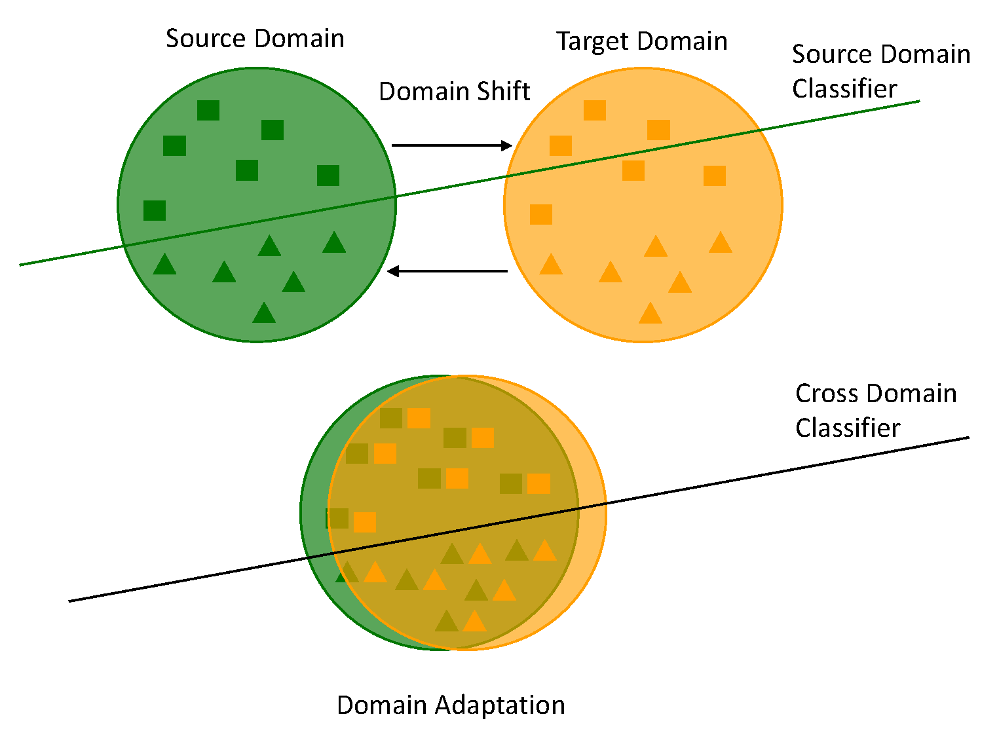

# Online Domain Adaptation Batch Normalization Layer for PyTorch

<p align="center">
    
</p>

This repository contains a [PyTorch](https://pytorch.org/) implementation of the Online DA-BN 
(`norm_layers.online.OnlineDABatchNorm`) layer as described in [Incremental Real-Time Personalization in Human Activity Recognition Using Domain Adaptive Batch Normalization](https://128.84.21.199/abs/2005.12178) 
currently submitted to UBICOMP / IMWUT. </br>
</br>

The implementation handles a stream of single incoming instances as described in the paper but can also handle incoming batches. In the latter case the batch norm statistics are computed over each batch and exponentially updated.
Further, there is a online implementation that takes an initial pre-estimation batch
 (`norm_layers.online.PreEstimateOnlineDABatchNorm`) and a full static batch implementation 
 (`norm_layers.static.StaticDABatchNorm`). Please see the documentation below. </br>
 The implementation is only 1-dimensional i.e. it can be only used in fully connected layers. </br>
 It is meant to be used as a regular `torch.Module` layer in a neural network model.
 Therefore, the overall network can also be [sent](https://pytorch.org/tutorials/beginner/blitz/data_parallel_tutorial.html) to CUDA as with any other native PyTorch module. </br>
 To use it in your code [set up](https://pytorch.org/get-started/locally/) PyTorch and check out the 
 [Tutorials Jupyter Notebook](Tutorial.ipynb) to see the layers usage. </br>
 </br>
This repository is released under the [AGPLv3 license](LICENSE).

## Citation Request
You are free to use any of this code for your research. 
If you do please cite: 
```
@misc{mazankiewicz2020incremental,
    title={Incremental Real-Time Personalization in Human Activity Recognition Using Domain Adaptive Batch Normalization},
    author={Alan Mazankiewicz and Klemens Böhm and Mario Bergés},
    year={2020},
    eprint={2005.12178},
    archivePrefix={arXiv},
    primaryClass={cs.LG}
}
```

## Documentation
### Static Batch DA-BN
Standardizes with target statistics from a pre-estimation batch.
```
from norm_layers.static import StaticDABatchNorm

class StaticDABatchNorm:

    def __init__(dim, domain_lst, epsilon=1e-5, momentum=0.1, safe_eval=True):
        """
        Constructor.
        :param int dim:               Dimensionality of input.
        :param list[int] domain_lst:  List containing domain ids e.g. list(range(5)) for 5 domains named 0,1,2,3,4.
        :param float epsilon:         Value added to the denominator of the normalization for numerical stability. Default: 1e-5.
        :param float momentum:        The exponential weighting factor used for the running_means and running_vars computation during training.
                                      Can be set to None for cumulative moving average (i.e. simple average). As in torch.BatchNorm. Default: 0.1.
        :param bool safe_eval:        Whether to run in safe evaluation mode. If true throws exception if not trained on all source domains. Default: True.
        """
        
    def forward(data, domain_ids=None):
        """
        Forward pass through layer. See PyTorch Documentation.
        :param FloatTensor data:      Batch of input features.
        :param LongTensor domain_ids: Only relevant for training. During testing = None.
                                      Contains domain_ids one for each instances in the batch. len = batch_size.
                                      Must be the same value for whole batch e.g. batch_size = 5, domain_id = 3 -> torch.tensor([3,3,3,3,3]).
                                      Does not have to represent ids from 0 to (no_domains -1) but can be any id.
                                      Default: None.
        :return FloatTensor:          Batch of same size as data, domain specific batch normalized values.
        """
    
    def reset_buffers():
        """Resets buffers to initialization state: running_means, running_vars, n, trained_domains."""
        
    def init_target(data):
        """
        Estimates target BN statistics for standardization during testing from data.
        Must be called before testing.
        :param FloatTensor data: Pre-estimation batch to be used to estimate taget BN statistics. 
        """
```

### Online DA-BN
Incrementally updates target person statistics in testing phase using exponential average.
Initial estimate as average of running statistics from training.

```
from norm_layers.online import OnlineDABatchNorm

class OnlineDABatchNorm:

    def __init__(self, dim, domain_lst, test_momentum, epsilon=1e-5, momentum=0.1, safe_eval=True):
        """
        Constructor.
        :param int dim:              Dimensionality of input.
        :param list[int] domain_lst: List containing domain ids e.g. list(range(5)) for 5 domains named 0,1,2,3,4.
        :param float test_momentum:  Online adaptation momentum. Must be in (0,1). Weights how strong adaptation to new point / batch should be.
        :param float epsilon:        Value added to the denominator of the normalization for numerical stability. Default: 1e-5.
        :param float momentum:       The exponential weighting factor used for the running_means and running_vars computation during training.
                                     Can be set to None for cumulative moving average (i.e. simple average). As in torch.BatchNorm. Default: 0.1.
        :param bool safe_eval:       Whether to run in safe evaluation mode. If true throws exception if not trained on all source domains. Default: True.
        """
        
    def forward(data, domain_ids=None):
        """
        Forward pass through layer. See PyTorch Documentation.
        :param FloatTensor data:      Batch of input features.
        :param LongTensor domain_ids: Only relevant for training. During testing = None.
                                      Contains domain_ids one for each instances in the batch. len = batch_size.
                                      Must be the same value for whole batch e.g. batch_size = 5, domain_id = 3 -> torch.tensor([3,3,3,3,3]).
                                      Does not have to represent ids from 0 to (no_domains -1) but can be any id.
                                      Default: None.
        :return FloatTensor:          Batch of same size as data, domain specific batch normalized values.
        """
    
    def reset_buffers():
        """Resets buffers to initialization state: running_means, running_vars, n, trained_domains."""
        
    def init_target():
        """
        Estimates initial target statistics as average of running statistics from training. 
        Must be called before testing.
        """

```


### Online Pre-Estimated DA-BN
Incrementally updates target person statistics in testing phase using exponential average.
Initial estimate from pre-estimation batch.

```
from norm_layers.online import PreEstimateOnlineDABatchNorm

class PreEstimateOnlineDABatchNorm:

    def __init__(self, dim, domain_lst, test_momentum, epsilon=1e-5, momentum=0.1, safe_eval=True):
        """
        Constructor.
        :param int dim:              Dimensionality of input.
        :param list[int] domain_lst: List containing domain ids e.g. list(range(5)) for 5 domains named 0,1,2,3,4.
        :param float test_momentum:  Online adaptation momentum. Must be in (0,1). Weights how strong adaptation to new point / batch should be.
        :param float epsilon:        Value added to the denominator of the normalization for numerical stability. Default: 1e-5.
        :param float momentum:       The exponential weighting factor used for the running_means and running_vars computation during training.
                                     Can be set to None for cumulative moving average (i.e. simple average). As in torch.BatchNorm. Default: 0.1.
        :param bool safe_eval:       Whether to run in safe evaluation mode. If true throws exception if not trained on all source domains. Default: True.
        """
        
    def forward(data, domain_ids=None):
        """
        Forward pass through layer. See PyTorch Documentation.
        :param FloatTensor data:      Batch of input features.
        :param LongTensor domain_ids: Only relevant for training. During testing = None.
                                      Contains domain_ids one for each instances in the batch. len = batch_size.
                                      Must be the same value for whole batch e.g. batch_size = 5, domain_id = 3 -> torch.tensor([3,3,3,3,3]).
                                      Does not have to represent ids from 0 to (no_domains -1) but can be any id.
                                      Default: None.
        :return FloatTensor:          Batch of same size as data, domain specific batch normalized values.
        """
    
    def reset_buffers():
        """Resets buffers to initialization state: running_means, running_vars, n, trained_domains."""
        
    def init_target(data):
        """
        Estimates target BN statistics for standardization during testing from data.
        Must be called before testing.
        :param FloatTensor data: Pre-estimation batch to be used to estimate taget BN statistics. 
        """

```


 
 
